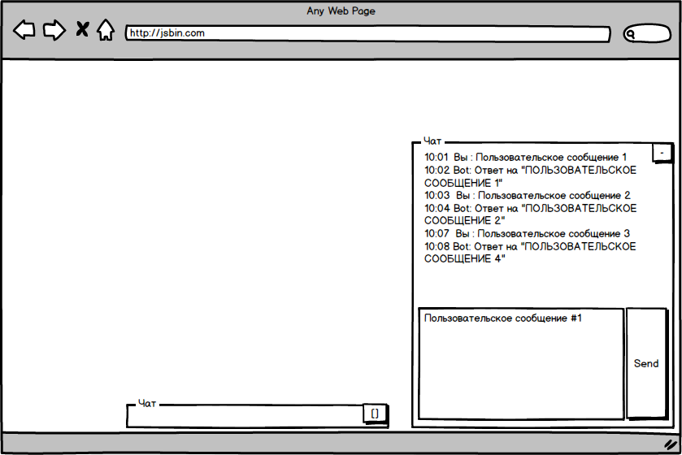

# Task 01 - Chat

Создать скрипт интерактивного чата. Чат должен быть предоставлен в виде одного скрипта, подключение которого на страницу (любую, просто включением тега скрипт с нужной ссылкой ) добавит на страницу окно чата.

```html
<!-- ... -->
<script src="https://path.for.your/script.file.js"></script>
<!-- ... -->
```



## Функционал

Окно должно показываться в нижнем правом углу, поверх основного содержимого страницы. У окна может быть два режима - свернуто и развернуто. При первом запуске окно свернуто, далее оно запоминает выбор пользователя и при обновлении страницы отображает окно в последнем активном состоянии.

Окно чата состоит из списка сообщений. Которое отображает время и историю сообщений. История сообщения сохраняется между обновлениями страницы. И формы отправки сообщения пользователем - многострочное поле ввода и кнопка отправки.

При нажатии на кнопку отправки - сообщение пользователя появляется в списке сразу. И через 15 секунд появляется ответ от бота в формате `Ответ на "{Сообщение пользователя в верхнем регистре}"`.

## Дополнение

Приложение ( как его части, так и оно целиком ), должны быть покрыты тестами [QUnit](https://qunitjs.com/).

В папке с выполненным заданием должен быть файл README со ссылками

* на пример работающего кода (например на [jsbin](http://jsbin.com/))
* на работающие тесты (можно загрузить туда же, на [jsbin](http://jsbin.com/) или использовать [glitch](https://glitch.com))

Эти же ссылки нужно прикрепить в описание пуллреквеста.

Для получения ссылкок на файлы с гитхаба можно использовать сервис https://rawgit.com/
