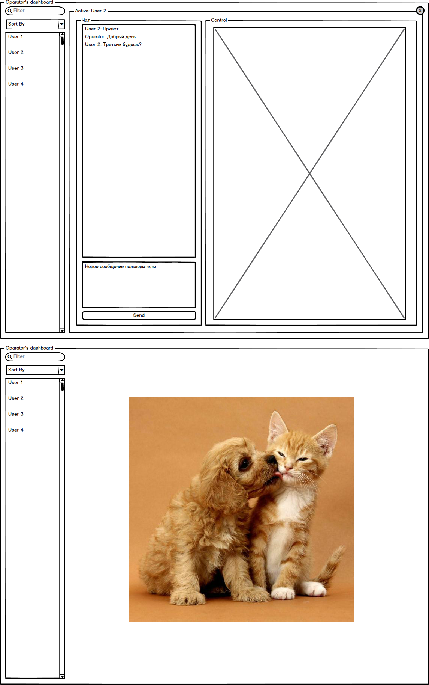

# Task 03 - Operators dashboard

Создать страницу для оператора чата.

Страница должна:

- Отображать список пользователей чата (Имя, состояние пользователя, состояние чата, непрочитанные сообщения)
- Позволять фильтровать пользователей по отображаемым полям, сортировать пользователей
- Клик по пользователю в списке делает его активным и переключает состояние рабочей области
- В рабочей области отображается история сообщений пользователя, и доступна возможность отправлять/получать сообщения от пользователя
- Клик по иконке в правом верхнем углу активной области очищает выбор пользователя

## Дополнение

Приложение ( как его части, так и оно целиком ), должны быть покрыты тестами [QUnit](https://qunitjs.com/).

В папке с выполненным заданием должен быть файл README со ссылками

- для демонстрации работы скриптов лучше использовать http://htmlpreview.github.io/

Ссылки на страинцу и страницу с тестами нужно прикрепить в описание пуллреквеста.

Для получения ссылкок на файлы с гитхаба можно использовать сервис https://rawgit.com/
