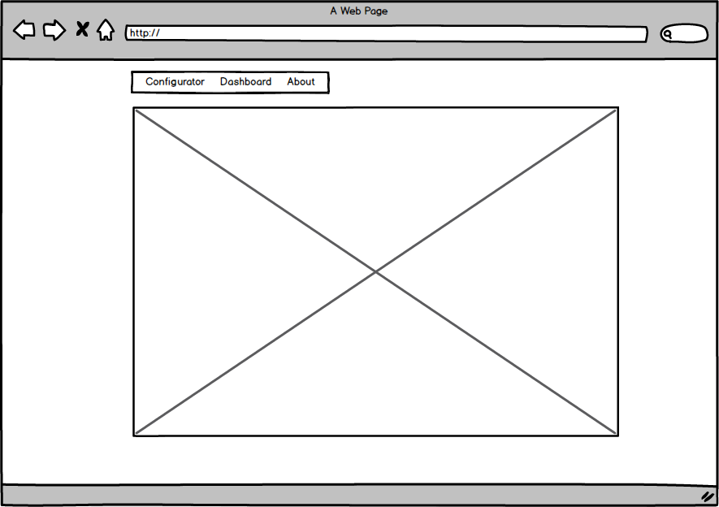

# SPA

## Рефакторинг

Разбить код на модули/файлы, которые будут обрабатываться системой сборки (убрать повторящийся код, учесть общий код для клиентского чата и дашборда)

## Одностраничное приложение

Перевести сервисную часть на одностраничное приложение (с использованием hash-api). Приложение должно быть представлено тремя страницами (роутами):

- Конфигуратор чата
- Дашборд
- О проекте

В верхней части страницы должно быть меню, реализующее навигацию между страницами. При переходе между страницами - должен изменяться URL. При обновлении страницы должно подтягиваться состояние приложения, соответствующее URL.

### Доп. информация

https://rawgit.com/vvscode/js--base-course/master/04/cls/index.html#/8
